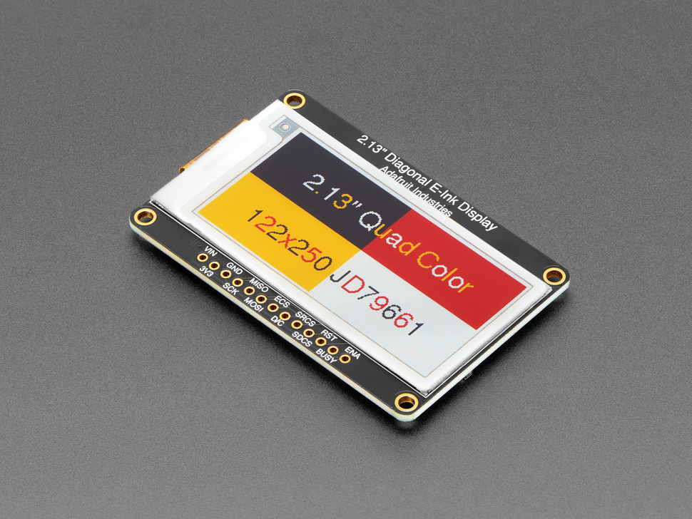

# Raspberry Pi 5 + Adafruit 2.13" Quad-Color E-Ink Display Setup

This guide covers the **pinout** and **Python environment setup** for the Adafruit 2.13" 250x122 Quad-Color E-Ink display (JD79661 chipset) on Raspberry Pi 5.

## Pinout (Recommended Wiring for Pi 5)

**Important:** Use GPIO 22 for ECS (CS) to prevent "GPIO busy" errors with Blinka/lgpio.

| Display Pin       | Raspberry Pi Physical Pin | BCM GPIO   | Notes                                      |
|-------------------|---------------------------|------------|--------------------------------------------|
| VIN               | Pin 1                     | 3.3V       | Use 3.3V (Pin 1) recommended               |
| GND               | Pin 6                     | GND        | Any GND pin                                |
| SCK               | Pin 23                    | GPIO 11    | SPI Clock                                  |
| MOSI              | Pin 19                    | GPIO 10    | SPI MOSI                                   |
| MISO              | Pin 21                    | GPIO 9     | Recommended                                |
| ECS (CS)          | Pin 15                    | GPIO 22    | **Must use this on Pi 5 (not CE0)**        |
| D/C               | Pin 22                    | GPIO 25    | Data/Command                               |
| RST               | Pin 13                    | GPIO 27    | Reset                                      |
| BUSY              | Pin 11                    | GPIO 17    | Busy signal                                |

**Do not connect** SRCS or SDCS for basic use.

## Python Environment Setup (Raspberry Pi OS Trixie)

### 1. Enable SPI
```bash
sudo raspi-config nonint do_spi 0
sudo reboot
```

### 2. Create Virtual Environment

```bash
rm -rf ~/.venv
python3 -m venv ~/.venv --system-site-packages
source ~/.venv/bin/activate
pip install --upgrade pip
```

### 3. Install Required Packages

```bash
pip install --upgrade \
    adafruit-blinka \
    adafruit-circuitpython-epd \
    adafruit-circuitpython-jd79661 \
    pillow
```

### 4. Script

```python
import board
import digitalio
import socket
import subprocess
import json
import os
import platform
from PIL import Image, ImageDraw, ImageFont
from adafruit_epd.epd import Adafruit_EPD
from adafruit_epd.jd79661 import Adafruit_JD79661

STATE_FILE = "wipink.json"

def get_wifi_ssid():
    try:
        output = subprocess.check_output(["iwgetid", "-r"], stderr=subprocess.DEVNULL).decode().strip()
        return output if output else "Not Connected"
    except Exception:
        return "Not Connected"

def get_ip_address():
    try:
        s = socket.socket(socket.AF_INET, socket.SOCK_DGRAM)
        s.connect(("8.8.8.8", 80))
        ip = s.getsockname()[0]
        s.close()
        return ip
    except Exception:
        return "No IP"

def get_hostname():
    return platform.node()

def load_last_state():
    if os.path.exists(STATE_FILE):
        try:
            with open(STATE_FILE, "r") as f:
                return json.load(f)
        except Exception:
            pass
    return {"hostname": "", "ssid": "", "ip": ""}

def save_state(hostname, ssid, ip):
    try:
        with open(STATE_FILE, "w") as f:
            json.dump({"hostname": hostname, "ssid": ssid, "ip": ip}, f)
    except Exception:
        pass

# ============== DISPLAY SETUP ==============
spi = board.SPI()

ecs   = digitalio.DigitalInOut(board.D22)   # Physical pin 15
dc    = digitalio.DigitalInOut(board.D25)
rst   = digitalio.DigitalInOut(board.D27)
busy  = digitalio.DigitalInOut(board.D17)
sram  = None

display = Adafruit_JD79661(
    122, 250, spi,
    cs_pin=ecs,
    dc_pin=dc,
    rst_pin=rst,
    busy_pin=busy,
    sramcs_pin=sram
)

display.rotation = 3

width = display.width
height = display.height

# Colors
WHITE  = (255, 255, 255)
BLACK  = (0,   0,   0)
YELLOW = (255, 255, 0)
RED    = (255, 0,   0)

# ============== GET CURRENT VALUES ==============
hostname = get_hostname()
ssid     = get_wifi_ssid()
ip       = get_ip_address()

last_state = load_last_state()

# Only update if anything changed
if (hostname == last_state.get("hostname") and
    ssid == last_state.get("ssid") and
    ip == last_state.get("ip")):
    print("Nothing changed. Skipping display update.")
else:
    print(f"Updating display → WiFi: {ssid} | Host: {hostname} | IP: {ip}")

    image = Image.new("RGB", (width, height), WHITE)
    draw = ImageDraw.Draw(image)

    # Fonts - good balance for this small display
    font_big   = ImageFont.truetype("/usr/share/fonts/truetype/dejavu/DejaVuSans-Bold.ttf", 26)
    font_small = ImageFont.truetype("/usr/share/fonts/truetype/dejavu/DejaVuSans.ttf",    22)

    # Center each line
    ssid_w = draw.textlength(ssid, font=font_big)
    host_w = draw.textlength(hostname, font=font_small)
    ip_w   = draw.textlength(ip, font=font_small)

    # Draw the three lines (WiFi Name on top, then Host Name, then IP)
    draw.text(((width - ssid_w) // 2, 12), ssid,     font=font_big,   fill=BLACK)
    draw.text(((width - host_w) // 2, 48), hostname, font=font_small, fill=BLACK)
    draw.text(((width - ip_w)   // 2, 78), ip,       font=font_small, fill=BLACK)

    # Nice double border: outer yellow + inner red
    draw.rectangle((3, 3, width-4, height-4), outline=YELLOW, width=3)
    draw.rectangle((7, 7, width-8, height-8), outline=RED,    width=2)

    # Send to display
    display.fill(Adafruit_EPD.WHITE)
    display.image(image)
    display.display()

    save_state(hostname, ssid, ip)

print("Done.")
```

### 5. Test the Script

```bash
source ~/.venv/bin/activate
python wipink.py
```

### 6. Make into a service

```bash
sudo nano /etc/systemd/system/wipink.service
```

```bash
[Unit]
Description=WiFi + Hostname + IP E-Ink Display Service
After=network-online.target
Wants=network-online.target

[Service]
Type=simple
User=djunod
WorkingDirectory=/home/djunod
ExecStart=/home/djunod/.venv/bin/python /home/djunod/wipink.py
Restart=always
RestartSec=10

# Optional: lower priority so it doesn't interfere with boot
Nice=10

[Install]
WantedBy=multi-user.target
```

Reload systemd and enable the service

```bash
sudo systemctl daemon-reload
sudo systemctl enable wipink.service
sudo systemctl start wipink.service
```

Check if it's working

```bash
sudo systemctl status wipink.service
```

To see logs

```bash
journalctl -u wipink.service -f
```

## Info

[Where to Buy](https://www.adafruit.com/product/6366)


